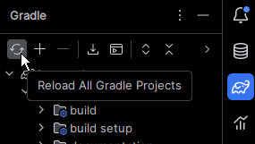

For now, these are just some tips:

## Writing tests

Contributions should include unit tests. In general, these should go in [src/test/java/com/spertus/jacquard](https://github.com/jacquard-autograder/jacquard/tree/main/src/test/java/com/spertus/jacquard). There are a few exceptions...

To test a method that would ordinarily be private, annotate it with the tag `@VisibleForTesting`, make the method package private, and put the test in the same package. [An example will be added soon.]

If you are testing `JUnitTester`, put your test in the ordinary location, but put any tests it runs dynamically in [`src/test/java/com/spertus/jacquard/junittester`](https://github.com/jacquard-autograder/jacquard/tree/main/src/test/java/com/spertus/jacquard/junittester) or a subdirectory,
tagging the class `"IndirectTest"`. For example, see [`JUnitTesterTest.java`](https://github.com/jacquard-autograder/jacquard/blob/main/src/test/java/com/spertus/jacquard/JUnitTesterTest.java), which dynamically runs [`SampleTest.java`](https://github.com/jacquard-autograder/jacquard/tree/main/src/test/java/com/spertus/jacquard/junittester/SampleTest.java).

## Running Tests

The `test/java` sourceset consists mostly of tests that should be directly run; however, 
it also contains some source files that are essentially resources for other tests. (Perhaps
these should be moved to `resources/`. These classes, which include [SampleTest](src/test/java/com/spertus/jacquard/junittester/SampleTest.java),
are tagged with `"IndirectTest"`, which causes them to be ignored when running the Gradle `test` task.

## build.gradle
IntelliJ sometimes grays out most of `build.gradle`. If this happens, select the circular arrows icon
`Reload All Gradle Projects` in the Gradle panel:

Publishing to Maven Central (Sonatype) requires a secret key, which is not part
of the distribution. It is stored in `settings.gradle`.

## Javadoc
Javadoc is automatically generated through a github action and pushed to [https://jacquard.ellenspertus.com](https://jacquard.ellenspertus.com)
when changes are merged into `main`.
