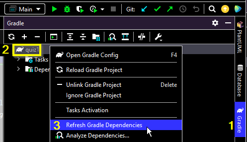

# Jacquard FAQ
* [How do I make sure I have the latest version of the Jacquard library?](https://github.com/espertus/jacquard-examples/blob/main/README.md#how-do-i-make-sure-i-have-the-latest-version-of-the-jacquard-library)
* [What configuration options are there?](https://github.com/espertus/jacquard-examples/blob/main/README.md#what-configuration-options-are-there)
* [How do I use Checkstyle?](https://github.com/espertus/jacquard-examples/blob/main/README.md#how-do-i-use-checkstyle)
* [What's PMD? How do I use it?](https://github.com/espertus/jacquard-examples/blob/main/README.md#whats-pmd-how-do-i-use-it)
* [How do I set test result visibility?](https://github.com/espertus/jacquard-examples/blob/main/README.md#how-do-i-set-test-result-visibility)
* [Why was the name "Jacquard" chosen?](https://github.com/espertus/jacquard-examples/blob/main/README.md#why-was-the-name-jacquard-chosen)

## How do I make sure I have the latest version of the Jacquard library?

See [Refreshing the Jacquard library](https://northeastern.hosted.panopto.com/Panopto/Pages/Viewer.aspx?id=8578e267-2bf0-4849-94c0-b066015c1ee3)
or follow these steps in IntelliJ:

1. Click on `Gradle` in the right sidebar.
2. Right-click (or control-click) on the project name (or the elephant icon to its left).
3. Select `Refresh Gradle Dependencies`.



## What configuration options are there?
There are currently 3 configurable values:
* `timeout` (default: `10_000L`), how many milliseconds to run a test before termination;
  a value of `0` means never to timeout
* `javaLevel` (default: 17), the Java language level used for [syntax-based graders](https://jacquard.ellenspertus.com/com/spertus/jacquard/syntaxgrader/package-summary.html)
* `visibility` (default: [`Visibility.visible`](https://jacquard.ellenspertus.com/com/spertus/jacquard/common/Visibility.html#VISIBLE)),
  the visibility of test results (except for `JUnitTester` results, which are specified differently)

To use the default values, call [`Autograder.init()`](https://jacquard.ellenspertus.com/com/spertus/jacquard/common/Autograder.html#init())
at the start of your program. Here's how to explicitly set other values:

```java
Autograder.Builder builder = Autograder.Builder.getInstance();

// By default, tests time out in 10,000 ms if they don't complete.
builder.timeout(5000); // set timeout to 5 s

// By default, Java level 17 is used.
builder.javaLevel(11); // use Java level 11

// By default, all tests results are visible.
builder.visibility(Visibility.HIDDEN); // hide test results
builder.build();
```
This can be written more concisely:
```
Autograder.Builder.getInstance()
    .timeout(5000)
    .javaLevel(11)
    .visibility(Visibility.HIDDEN)
    .build();
```

See also the [Autograder configuration chapter](https://northeastern.hosted.panopto.com/Panopto/Pages/Viewer.aspx?id=ba36573d-dd4a-493d-8b3d-b06a0181c9ff&start=15) (0:15-2:06) from [Taking a first look at Homework 1](https://northeastern.hosted.panopto.com/Panopto/Pages/Viewer.aspx?id=ba36573d-dd4a-493d-8b3d-b06a0181c9ff).

## How do I use Checkstyle?

For general usage information, see [Checkstyle website](https://checkstyle.sourceforge.io/), 
especially [Checkstyle configuration](https://checkstyle.sourceforge.io/config.html). 

Here is how to create a `CheckstyleGrader` in Jacquard:

```java
CheckstyleGrader checkstyleGrader = new CheckstyleGrader(
        "config/checkstyle-rules.xml", // path to configuration file
        1.0, // penalty per violation
        5.0); // maximum penalty/points
```

See also the [`CheckstyleGrader` javadoc](http://jacquard.ellenspertus.com/com/spertus/jacquard/checkstylegrader/CheckstyleGrader.html).

We recommend putting your configuration file in your project's `config/`
directory so it is copied to Gradescope. We also recommend sharing it with
students so they can run checkstyle in their
IDE ([IntelliJ plugin](https://plugins.jetbrains.com/plugin/1065-checkstyle-idea),
[Eclipse plugin](https://checkstyle.org/eclipse-cs/#!/))
before uploading. The IntelliJ plugin supports using a local configuration
file or accessing one via URL, so students don't need to download it
(but will need to configure the plugin to point to it).

For more detail, see
[Jacquard Example 0](https://github.com/jacquard-autograder/jacquard-example0).

## What's PMD? How do I use it?
[PMD](https://pmd.github.io/) (which is not an acronym) is a source code analyzer
capable of more complex checks than Checkstyle, such as whether the `@Override`
annotation is always used where permitted.

PMD rules are organized into rulesets, which, as the name suggests, are sets of rules.
You can [make your own rulesets](https://pmd.github.io/pmd/pmd_userdocs_making_rulesets.htm)
or use [Java rulesets](https://github.com/pmd/pmd/tree/master/pmd-java/src/main/resources)
built in to PMD, such as [`category/java/bestpractices.xml`](https://github.com/pmd/pmd/blob/master/pmd-java/src/main/resources/category/java/bestpractices.xml).

Jacquard's [PMDGrader](https://jacquard.ellenspertus.com/com/spertus/jacquard/pmdgrader/PmdGrader.html)
has two static factory methods:
* [`createFromRuleSetPaths()`](http://jacquard.ellenspertus.com/com/spertus/jacquard/pmdgrader/PmdGrader.html#createFromRuleSetPaths(double,double,java.lang.String...)),
  which lets you specify one or more rulesets to be used in their entirety [used in [Jacquard Example 0](https://github.com/jacquard-autograder/jacquard-example0)]
* [`createFromRules()`](http://jacquard.ellenspertus.com/com/spertus/jacquard/pmdgrader/PmdGrader.html#createFromRules(double,double,java.lang.String,java.lang.String,java.lang.String...)), 
  which lets you specify one ruleset and one or more rules from that ruleset [used in Jacquard Example 2]

There are PMD plugins for [IntelliJ](https://plugins.jetbrains.com/plugin/1137-pmd) and [Eclipse](https://marketplace.eclipse.org/category/free-tagging/pmd).

## How do I set test result visibility?

Gradescope specifies four levels of visibility in [Autograder Specifications](https://gradescope-autograders.readthedocs.io/en/latest/specs/):

* `hidden`: test case will never be shown to students
* `after_due_date`: test case will be shown after the assignment's due date has passed. If late submission is allowed, then test will be shown only after the late due date.
* `after_published`: test case will be shown only when the assignment is explicitly published from the "Review Grades" page
* `visible` (default): test case will always be shown

These is a one-to-one correspondence between these visibility levels and the enumerated type [`Visibility`](http://jacquard.ellenspertus.com/com/spertus/jacquard/common/Visibility.html).

Unless otherwise specified, all test results are immediately `visible` to students.

### `JUnitTester` results
Unit tests run through [`JUnitTester`](https://jacquard.ellenspertus.com/com/spertus/jacquard/junittester/JUnitTester.html) (as
opposed to the cross-tester) must be annotated with [`@GradedTest`](https://jacquard.ellenspertus.com/com/spertus/jacquard/junittester/GradedTest.html). The
attribute `visibility` has the default value [`Visibility.VISIBLE`](https://jacquard.ellenspertus.com/com/spertus/jacquard/common/Visibility.html#VISIBLE) but
can be set to any other visibility. This code is from [Jacquard Example 0](https://github.com/jacquard-autograder/jacquard-example0):
```java
    @Test
    @GradedTest(name = "works for empty list", points = 5.0, visibility = Visibility.AFTER_PUBLISHED)
    public void iteratorOverEmptyList() {
        FavoritesIterator<String> iterator = new FavoritesIterator<>(favoriteHotSauces0);

        // No items should be returned.
        assertFalse(iterator.hasNext());
        assertThrows(NoSuchElementException.class, () -> iterator.next());
    }
```

### Other results
The visibility level can be set for all other types of autograder results through the
[initial configuration](https://github.com/espertus/jacquard-examples/blob/main/README.md#what-configuration-options-are-there).

The visibility level of a generated [`Result`](https://jacquard.ellenspertus.com/com/spertus/jacquard/common/Result.html) can be mutated by calling the [`changeVisibility(Visibility visibility)` instance method](https://jacquard.ellenspertus.com/com/spertus/jacquard/common/Result.html#changeVisibility(com.spertus.jacquard.common.Visibility)) or [`Result.changeVisibility(List<Result> results, Visibility visibility)`](https://jacquard.ellenspertus.com/com/spertus/jacquard/common/Result.html#changeVisibility(java.util.List,com.spertus.jacquard.common.Visibility)), as shown:

```java
        // Use the default configuration, which includes full visibility.
        Autograder.init();
        final Target target = Target.fromClass(FavoritesIterator.class);
        List<Result> results = new ArrayList();

        // Checkstyle results should be fully visible.
        CheckstyleGrader checkstyleGrader = new CheckstyleGrader(
                "config/checkstyle-rules.xml",
                1.0,
                5.0);
        results.addAll(checkstyleGrader.grade(target));

        // PMD results should be visible only after the due date.
        PmdGrader pmdGrader = PmdGrader.createFromRules(
                1.0,
                5.0,
                "category/java/bestpractices.xml",
                "MissingOverride");
        List<Result> pmdResults = pmdGrader.grade(target);
        // Change visibility before adding to results.
        Result.changeVisibility(pmdResults, Visibility.AFTER_DUE_DATE);
        results.addAll(pmdResults);
```

## Why was the name "Jacquard" chosen?

The CSV files used for cross-testing made me think of looms, such as the [looms created by
Joseph Marie Jacquard](https://en.wikipedia.org/wiki/Jacquard_machine), which were
controlled by punched cards so play an important role in computing history. Also, the
starting letters correspond to Java or Java Autograder. Claude.ai suggested
this backronym: _Java Assignment Checking with Quality Unit-testing, Analysis, Reporting, and Diagnostics_.


## Where can I get support?

There are low-volume Google
groups [jacquard-announce](https://groups.google.com/g/jacquard-announce)
and [jacquard-discuss](https://groups.google.com/g/jacquard-discuss).

You can also [create issues](https://github.com/jacquard-autograder/jacquard/issues)
(feature requests and bug reports).

[](https://jacquard.ellenspertus.com/)
